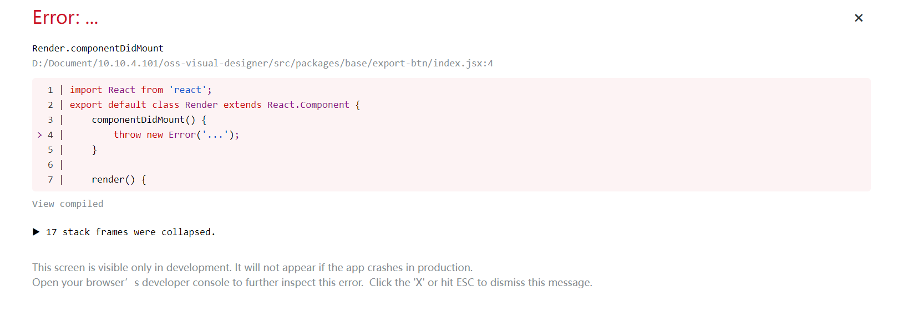

# REACT

## React 是什么

React 是一个开源二点用于构建用户界面的前端 js 库，尤其是单页面应用。

## React 的主要特征有哪些

-   使用虚拟 DOM 代码真实 DOM 的耗费资源的操作
-   支持服务端渲染
-   单向数据流
-   开发模式是以组件为基础的，强调组件的可复用性和由组件构成页面

## jsx

jsx 是一个类 xml 的 js 语法扩展。最终还是描述了页面 dom 结构，只不过会由 React.creatElement()生成 js 对象，然后映射到真实 dom。优点是 dom 的结构化描述性。

## react 组件(Component)和元素(Element)

元素是由 React.createElement(name,props,children)生成的对象

```js
{
  type: 'div',
  props: {
    children: 'Login',
    id: 'login-btn'
  }
}
```

最终这个对象会交给 ReactDom.render()渲染为真实 dom。

组件是一个接收 props 返回元素的函数或者是类，为类时，需要写 render 方法返回元素。

## PureComponent 与 Component 区别

PureComponent 是在 Component 基础上又封装了 shouldComponentUpdate 方法，该方法中浅对比了 props 和 state，决定是否重新渲染，判断返回的结果为 true 就是重新渲染。

## React 中的 state 是什么？

一个组件需要展示数据和有一些数据的状态，这些数据就成为了一个组件的 state，通过这些数据的改变，来引起组件显示的改变。

## React 中的 props 是什么？

props 相当于是父组件（或者祖先组件）传给子组件的参数，jsx 上表现就是所有的标签名之外的参数就会在组件中以 this.props 接收(类组件)。

## props 和 state 的异同

相同点：首先他们都是 js 对象。对象上都保存了一些影响页面展示的数据，
不同点：props 来源是父组件（或者祖先组件）传给子组件的参数，统一在这里接收，state 是属于当前组件的内部数据，一般只影响当前组件内部状态，如果传给子孙组件，当当前组件的 state 改变时，子组件会在 props 中接收到父组件传来的改变。

## 我们为什么不能像修改 js 对象那样修改 state

state 一般的作用是会影响到渲染的，重新渲染是需要重新生成 element，比如在类组件中，重新生成 element 的操作只有重新执行 render 方法，那么重新执行的时机是需要 react 控制的，普通的修改 js 对象，js 是不会捕捉到这个操作的，需要执行 react 提供的方法，让 react 收到这个操作后就重新执行 render 就可以了。这个 react 提供的操作就是挂载在组件实例上的 setState 方法。

## setState 方法的第二个参数，有什么用？

首先第二个参数是一个函数对象，并且回调函数，回调在 setState 的操作完成并且页面被正确渲染完成后就会被调用执行。

## html 和 react 的事件绑定区别

-   书写
    html 的事件绑定是小写事件名在标签中`onclick="()"`
    react 的事件绑定是要小驼峰的形式写在 jsx props 位置的。`<button onClick={activateLasers}>`

-   阻止默认事件

html 中`return false` react `e.preventDefault()`

-   ()的写法

上边的写法中写到了。html 标签中的事件名后紧跟了`()`,而 react 中只传递了函数名。

## jsx 中的事件绑定

如 onClick 方法，传递函数名，函数处理逻辑中会有改变组件状态的 this.setState 方法，但是因为 this 语法的特殊性，如果这里直接写 this.setState,那么 this 不是指向该组件的，所以要将 this 绑定指向到该组件，

-   在 constructor 中做 bind 绑定。
-   使用新语法，Public class fields syntax。实例的函数属性使用箭头函数定义，this 就被默认绑定到定义时的指向。

## react 中的合成事件

合层事件是对于浏览器原生事件的包装，因为各种浏览器对于事件的处理可能不同，react 的事件处理逻辑肯定要书写一致，不同浏览器的处理不同就交给 react 来抹平了，就是通过合成事件实现的。所以我们在 jsx 中写的 onClick 事件并不是直接赋在 html 标签的原生的 onclick 方法，是 react 包装过的。

## key props 的作用

key 是一个特殊的 prop，在子组件的 props 中不会接收到这个 key。当创建一个数组元素渲染时，应该传递 key 属性，react 内部使用它来识别数组元素，哪些被改动，移除或者添加删除了。

那么应该传递给 key 什么值呢？

传递给 key 的值应该是稳定的，一对一的，最好不要一个 key 的值可能对应数组的不同元素。所以一般用数组的 id 来表示唯一。

如果没有稳定的 id，那么会用索引来做。这么做的话，如果这个数组的元素的顺序是可以变动的，那么会有性能问题，这是不推荐的。

note：如果循环渲染的元素是一个封装的组件，那就把 key 属性赋值在组件的 props 上，而不是在组件内部；如果一个列表元素没有 key 属性，react 会发出一个警告

## ref

ref 代表一个引用，它可以引用任何值。他的值使用 ref.currenth 获取。当设置在 jsx 的 ref 属性上时，如果这个 jsx 元素是一个原生 html tag，那么这个 ref 的值引用就是这个 dom 元素；如果这个 jsx 元素是 react 组件，那就引用的是这个组件，通过 ref 可以获取该组件实例；其他情况就是将 ref 当作一个普通的 js 对象使用，他的引用是稳定的，不会修改指向。

在用 ref 赋值给 dom 之前使用 findDOMNode(),已经是过时的 api，因为它阻止了 react 未来可能的优化策略。

### 创建 ref

类组件： `this.myRef = React.createRef()`
函数组件：`const myRef = useRef()`
回调函数 ref：这里的回调函数接收 React 组件实例或 html dom 元素作为参数 `<component ref={e=>{this.ref = e}}>`，react 会在组件挂载时，调用 ref 回调函数并传入 dom 元素、组件，当卸载时，调用它并传入 null，并且在 didmount 和 didupdate 触发前，保证 ref 是最新的

字符串 ref 已不推荐使用。

### forwardRef

利用它，可是实现让组件获取他们收到的 props 中写的 ref，从而把该 ref 赋给组件的元素甚至子组件下。

## 虚拟 dom

### 定义

虚拟 dom 是存在与内存中对于真实 dom 描述的 js 对象，它与真实 dom 的结构保持同步。在 render 函数调用后，直到 dom 被真实渲染在屏幕上，有一个过程叫*协调*

### 虚拟 dom 如何工作

分为简单的三步

1. 一个组件树的状态数据修改时，整个 ui 会被重新渲染，重新渲染需要依赖虚拟 dom 生成。
2. 生成虚拟 dom 后，就需要与旧的虚拟 dom 树进行对比，找出差异
3. 对比差异后，真实的 dom 被更新，_这里被更新就是状态数据影响的那部分，其他部分不会被更新_。

### shadowDom 与 virtualDom 的不同

完全是两个不同的东西。shadowdom 是一个浏览器提供的新的功能，为 web 组件和 css 添加了作用域范围。
而虚拟 dom 是 js 库的作者开发库时的设计概念和名词。

## react fiber

在 react 16 版本中，react 官方引入了新的核心协调引擎。他的作用在于处理 react 状态更新时，更合理的处理页面展示更新的优先级或者暂停、开始等更新任务。[了解更多](https://github.com/acdlite/react-fiber-architecture)

-   可以将任务分割成可以中断的任务碎片
-   能够处理优先级高的任务、重置任务状态、重新开始任务
-   Ability to yield back and forth between parents and children to support layout in React.
-   Ability to return multiple elements from render().
-   Better support for error boundaries.

## 受控组件和非受控组件

受控：顾名思义就是组件的状态是被外部控制的，不受自己控制。非受控相反。通常就是一个组件的状态是接收外部的 props 控制，当组件状态改变也是通过外部 props 改变通知到组件内部的。非受控组件是内部状态是自己的内部的状态，外部想要获取该组件的状态需要通过其他途径获取（ref）

## createElemtn 与 cloneElement

createElement 是 jsx 底层的调用函数，返回一个新的 react 元素。cloneElement 是用一个元素作为模板，支持重新赋值它的 props（chldren、key、ref），新的 props 与旧的 props 的合并策略是浅合并，新的 props 中没有的 prop 将使用旧的 props 中的 prop。

```jsx
React.cloneElement(
  element,
  [config],
  [...children]
)
// 其实就相当于
<element.type {...element.props} {...props}>{children}</element.type>
```

## 生命周期

首先是 react 组件的三个不同阶段：

1. 挂载中。组件的数据状态将反应到 dom 上。与这个阶段有关系的生命周期有`constructor`,`getDerivedStateFromProps`,`render`,`componentDidMount`
2. 更新中。有两种方式可以将组件状态转化为更新中。props 改变和 state 改变（setState 和 forceUpdate）。与这个阶段有关系的生命周期有`getDerivedStateFromProps`，`shouldComponentUpdate`,`render`,`getSnapshotBeforeUpdate`,`componentDidUpdate`
3. 将要卸载。在这个阶段，react 组件将要从 dom 中移除，生命周期有`componentWillUnmount`

前两个阶段，react 在将状态反映成 dom，展示在屏幕的过程中，经历过三个过程：

1. render 阶段。在这个阶段，组件渲染没有任何副作用，在这个阶段，react 可以暂停、终止、重启渲染。
2. pre-commit 阶段。在组件实际将改变应用到 dom 上之前，在这个时刻，允许 react 从 dom 中读取状态，在`getSnapshotBeforeUpdate`周期可以获取。
3. commit 阶段。这个阶段 react 就要更新 dom。相应的生命周期会被执行，挂载时是 componentDidMount,更新时是 componentDidUpdate,卸载时是 componentWillUnmount

### 生命周期列表

[react 生命周期图谱](https://projects.wojtekmaj.pl/react-lifecycle-methods-diagram/)

## 高阶组件

高阶组件是一个函数，它的入参是一个 react 组件，返回值是一个新组件。这是基于 react 的可组合特性抽象出的模式。

高阶组件的用例通常有：

1. 代码复用，逻辑重用和抽象
2. 渲染劫持
3. state 抽象和封装
4. props 封装

## context

context 提供了新的传递 props 的方式，这种方式无需一层一层的向下传递 props。

```jsx
const { Provider, Consumer } = React.createContext(defaultValue);
```

## children prop

children 其实就是一个普通的 prop，只不过它的形式是将组件作为数据传递，而且一个标 jsx 标签的开始和闭合标签中间的内容，都被作为 children props 传递。

关于 children props 的 API 有`React.children.map`、`React.children.forEach`、`React.children.count`、`React.children.only`、`React.children.toArray`

## react.lazy 函数

React.lazy 接受一个函数，这个函数需要动态调用 import()。它必须返回一个 Promise，该 Promise 需要 resolve 一个 default export 的 React 组件。

## createPortal

createPortal(child, container)

创建 portal。Portal 提供了一种将子节点渲染到已 DOM 节点中的方式，该节点存在于 DOM 组件的层次结构之外。

## error boundary 错误边界

### 开发 react 中的错误

开发 react 应用时，在`mode=development`模式下，如果有 js 报错，会发现页面会出现一个报错的显示，如图


根据提示文字可以找到出错的代码在源码中对应的位置，点击出错行甚至可以直接拉起编辑器并定位到对应出错位置。开发体验满满，那这是如何实现的呢？

首先该效果肯定是在开发模式下出现的，在生产环境下，显然不适合出现这个不友好的界面。要显示报错，肯定是开发环境监听了错误的产生，在 create-react-app 找到开发服务器的配置,在 config/webpackDevServer.config.js 中引入了两个库

```js
const errorOverlayMiddleware = require('react-dev-utils/errorOverlayMiddleware');
const evalSourceMapMiddleware = require('react-dev-utils/evalSourceMapMiddleware');
```

在 server 配置中 use 了两个中间件

```js
before(app, server) {
    // Keep `evalSourceMapMiddleware` and `errorOverlayMiddleware`
    // middlewares before `redirectServedPath` otherwise will not have any effect
    // This lets us fetch source contents from webpack for the error overlay
    app.use(evalSourceMapMiddleware(server));
    // This lets us open files from the runtime error overlay.
    app.use(errorOverlayMiddleware());

    if (fs.existsSync(paths.proxySetup)) {
        // This registers user provided middleware for proxy reasons
        require(paths.proxySetup)(app);
    }
},
```

看字面意思大致可以猜到`evalSourceMapMiddleware`是对应报错在源码中的位置，`errorOverlayMiddleware`可能就是显示的报错 ui。

var ErrorOverlay = require('react-error-overlay');
深入到`errorOverlayMiddleware`库中发现依赖了`require('react-error-overlay')`,

该库中有监听错误的逻辑和展示报错的 ui 组件，知道该库正是 create-react-app 预置环境展示报错的源码部分。

### 引出 error-boundary

js 会有报错
||
react 16 版本之前报错不会崩溃，16 之后会卸载组件树
||
卸载后防止白屏，需要展示降级 ui 用户体验
||
error-boundary
||
一般来说整个应用只需一个包裹，如果不同部分报错后不影响其他部分就使用多个

如上所述开发环境下会有友好的界面方便开发，在生产环境下肯定不会出现。那在生产环境会有什么效果呢？

回顾之前的多页面应用开发过程，当报错时，往往在控制台显示报错的代码和错误堆栈，这种方式其实是有问题的，假定一种情况：
当点击某一个 dom，修改一个变量的值（例如+1）成功，然后有段逻辑出现了报错，报错的逻辑之后还需要修改一个变量的值（还是+1），用户预想的是两个变量需要同步，因为中间的报错，没有保持两个变量同步，那么后面的操作可能偏差越来越大。

官方举例：”我们对这一决定有过一些争论，但根据我们的经验，把一个错误的 UI 留在那比完全移除它要更糟糕。例如，在类似 Messenger 的产品中，把一个异常的 UI 展示给用户可能会导致用户将信息错发给别人。同样，对于支付类应用而言，显示错误的金额也比不呈现任何内容更糟糕。“

类似情况在 react 中出现之后，因为 react 是由数据驱动 ui 的，数据状态的紊乱，被破坏，那么渲染时必定就会产生错误。在 react 16 版本之前这些未被捕获的错误是不影响整个组件树的，**但是在 16 版本之后，任何未被错误边界捕获的错误将会导致整个 React 组件树被卸载。**

react 认为在渲染已经出错的情况下，最好终止整个渲染过程（防止累积错误？）。

这种错误就是由于之前的状态出错造成的，所以在这些错误出现的早期就处理掉是最好的处理方式。

组件树被卸载后，页面显示一个降级的 ui 是好的体验，error-boundary 提供了此便利。

那么 error-boundary 是什么？

error-boundary 是一个组件，是一个特殊的组件。

如果一个 class 组件中定义了 static getDerivedStateFromError() 或 componentDidCatch() 这两个生命周期方法中的任意一个（或两个）时，那么它就变成一个错误边界。当抛出错误后，请使用 static getDerivedStateFromError() 渲染备用 UI ，使用 componentDidCatch() 打印错误信息。可以看出**目前只有 class 组件才可以成为一个 error-boundary 组件，因为函数组件没有该生命周期**

错误边界可以捕获发生在整个子组件树的渲染期间、生命周期方法以及构造函数中的错误。

以下场景的报错不会被捕获到：

-   事件处理（React 不需要错误边界来捕获事件处理器中的错误。与 render 方法和生命周期方法不同，事件处理器不会在渲染期间触发。因此，如果它们抛出异常，React 仍然能够知道需要在屏幕上显示什么。）
-   异步代码（例如 setTimeout 或 requestAnimationFrame 回调函数）
-   服务端渲染
-   它自身抛出来的错误（并非它的子组件，仅可以捕获其子组件的错误）

```jsx
class ErrorBoundary extends React.Component {
    constructor(props) {
        super(props);
        this.state = { hasError: false };
    }

    static getDerivedStateFromError(error) {
        // 更新 state 使下一次渲染能够显示降级后的 UI
        return { hasError: true };
    }

    componentDidCatch(error, errorInfo) {
        // 你同样可以将错误日志上报给服务器
        logErrorToMyService(error, errorInfo);
    }

    render() {
        if (this.state.hasError) {
            // 你可以自定义降级后的 UI 并渲染
            return <h1>Something went wrong.</h1>;
        }

        return this.props.children;
    }
}
```

验证：
在 react 版本大于 16 的项目中，在非根组件之上包裹 error-boundary 组件，当出现错误后，发现根容器到 error-boundary 之间的层级依然是有 dom 出现的，不包裹 error-boundary，出现错误后整个 root 组件被卸载，出现白屏。

大多数情况下, 你只需要声明一次错误边界组件, 并在整个应用中使用它。

## react-dom 包的用处

主要用`import ReactDOM from 'react-dom' ReactDOM.render(<Component />, node，[callback]),React.unmountComponentAtNode()`,

使用 ReactDOM.render 将 react 组件渲染到指定页面的节点上，也有`React.unmountComponentAtNode`用于卸载某个节点上挂载的 react 节点。render 方法的第三个参数可选，回调参数，当组件被渲染或者被更新时会执行该回调函数。

服务端渲染时用到了`react-dom/server`模块，使用 renderToString 方法写入 html 服务端返回

```js
// using Express
import { renderToString } from 'react-dom/server';
import MyPage from './MyPage';

app.get('/', (req, res) => {
    res.write('<!DOCTYPE html><html><head><title>My Page</title></head><body>');
    res.write('<div id="content">');
    res.write(renderToString(<MyPage />));
    res.write('</div></body></html>');
    res.end();
});
```

## react 的优缺点

### 优点

### 缺点
