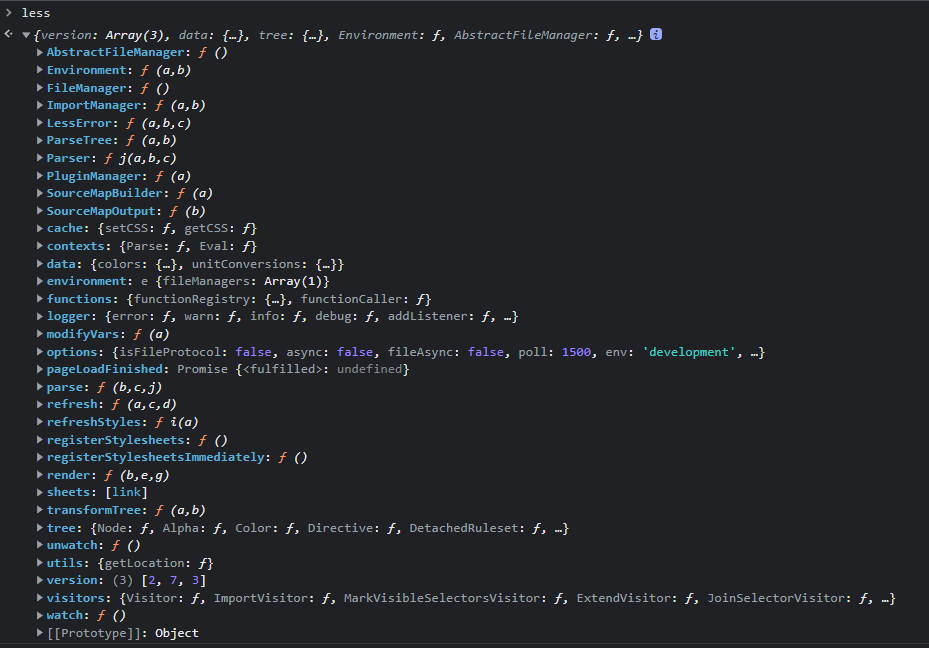

# 主题、换肤

## 目前 oss 用的方案

### 关于 less

modifyVars 方法

less 是一种 css 预处理器，支持变量、mixins、函数等功能。额外的 less 提供了一个`less.js`文件。
引入该文件后会在全局定义一个全局变量`less`。如图:.其中有一个方法`modifyVars`。测试 demo:`./less/modifyVars/indx.html`,点击第一个 div 时，第二个 div 的 color 切换册成功。调试发现，页面初始化后，在 head 标签中除了 link 标签引入 less 文件外，还有一个 style 标签，该标签内容是 color.less 的内容将 less 变量替换后的真实内容，当点击事件触发后，函数的传参意味着将 less 的变量成 yellow，此时观察 style 标签中的代替颜色的变量，被替换成了 yellow。总结猜想过程是在引入 less.js 文件后，该文件会遍历 head 标签中的 link 引入的 less 文件，然后解析 less 文件内容，把用到 less 变量的地方都替换成真实的值,生成真实 css 的内容之后在 head 中插入一个新的 style 标签,样式生效。当做点击操作时，会再做一遍这个流程从而达到动态切换主题功能。

less-loader 中的 modifyVars 方法使用：
在 webpack 中的 module.rules 中配置使用 less-loader 处理 less 文件时，可支持传入如下配置

```js
{
    loader: require.resolve('less-loader'),
    options: {
        sourceMap: true,
        lessOptions: {
            javascriptEnabled: true,
            modifyVars: {
                '@default-color': 'red',
            },
        },
    },
},
```

这里的 modifyVars 作用是在处理 less 文件时，当遇到在其中定义过的变量时（key），将该变量的替换成这里的 value。在 antd 文档中，这个方案被官方推荐定制一个主题，也就是在写代码时，将一整套用到的统一颜色抽象成一套变量名和真实值的一组映射，代码只用该变量代替颜色就可以。然后用 webpack 打包时，统一替换变量为真实色值。这里的一组映射就是一套主题.
