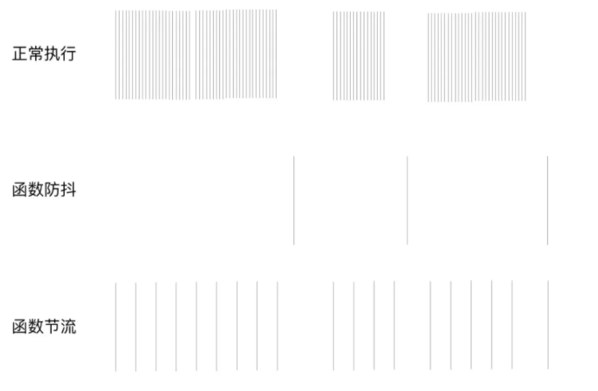

# 节流和防抖

属于性能优化的知识，在开发中常见的浏览器的 resize、scroll、keypress、mousemove 等事件在触发时，会不断地调用绑定在事件上的回调函数，极大地浪费资源，降低前端性能,节流和防抖是用来降低这些高频事件的触发次数。

## 节流

n 秒内只运行一次，若在 n 秒内重复触发，只有一次生效
基础实现

```js
function throttle(func, delay) {
  let flag = true;

  return function () {
    if (!flag) {
      return;
    }

    flag = false;

    timer = setTimeout(() => {
      func.apply(this, arguments);
      flag = true;
    }, delay);
  };
}
```

## 防抖

n 秒后在执行该事件，若在 n 秒内被重复触发，则重新计时

基础实现

```js
function debounce(func, delay) {
  let timer = null;

  return function () {
    clearTimeout(timer);

    timer = setTimeout(() => {
      func.apply(this, arguments);
    }, delay);
  };
}
```

## 异同点

相同点

    - 都可以通过使用 setTimeout 实现
    - 目的都是，降低回调执行频率。节省计算资源

不同点

    - 函数防抖，在一段连续操作结束后，处理回调，利用 clearTimeout 和 setTimeout 实现。函数节流，在一段连续操作中，每一段时间只执行一次，频率较高的事件中使用来提高性能
    - 函数防抖关注一定时间连续触发的事件，只在最后执行一次，而函数节流一段时间内只执行一次

例如，都设置时间频率为 500ms，在 2 秒时间内，频繁触发函数，节流，每隔 500ms 就执行一次。防抖，则不管调动多少次方法，在 2s 后，只会执行一次

如下图所示：

